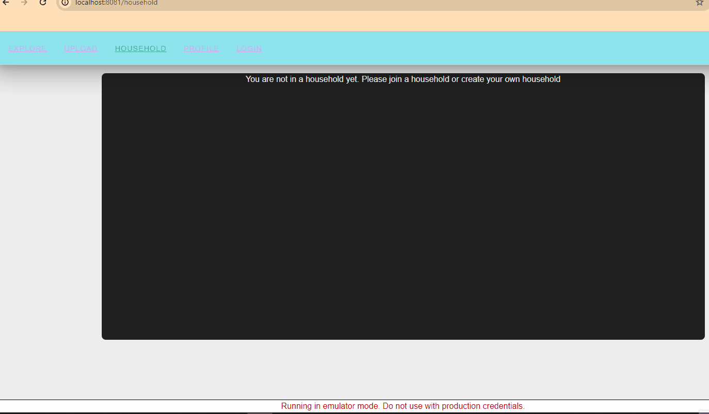

# groceries-vue-app

An application for managing your pantry inventory, planning meals, and enhancing your cooking experience. 

## Project Overview

This repository is a modernization of the web2py project [Unpack the Pantry](https://bitbucket.org/ergerodr/groceriesapi/src/master/) with a focus on improving development speed and user experience. 

Development and deployment is now faster, easier with the usage of the Google Cloud Platform.

## Features

### Inventory management

Web2py was primarily used for both front and backend in the first version. Static web pages were served and 
users were forced to reload each webpage to navigate. Vue.js' primary use case was for making the main recipe 
search page more dynamic.


### Recipe search

One of the major challenges of the application was the recipe search. While it works with basic queries for now,
eventually the search page will recommend recipes to minimze food waste by prioritizing aging inventory. 


### Account Authentication

In the 2nd version, vue.js was brought to the foreground 
creating a modern dynamic experience when navigating the site. Serverside logic is written using Google Cloud 
Functions and is hosted on Google Cloud.




## Build and Installation

Currently, [Firebase cloud emulators](https://firebase.google.com/docs/emulator-suite) are the primary method 
to host this project. This project uses the Authentication, Firestore, Web Hosting and Cloud Functions 
emulators. 

```sh
firebase emulators:start
```


Docker Compose is used to build the Vue.js Frontend.

```sh
docker compose up #builds app
docker compose down #destroys app
```


